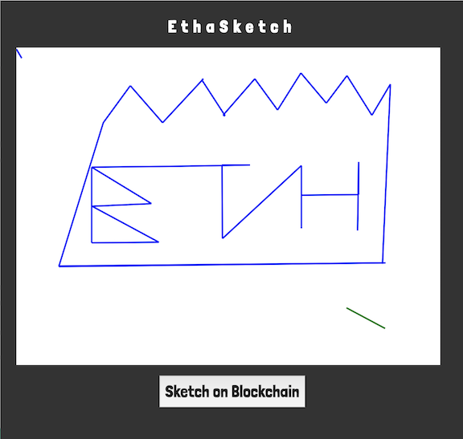

### Sketch on the blockchain and have a machine copy your sketches IRL!

### Tech

#### IOT Side:
ESP8266 -> Driver Code -> MQTT -> WebSocket
Websocket for MQTT + The Graph Websocket => Sends drawings to grapher
VueJS for MQTT management

## User DApp Side:
Websocket for Fortmatic Web 3.0 Bridge
GraphQL for the Graph API
ReactJS for Event Management
